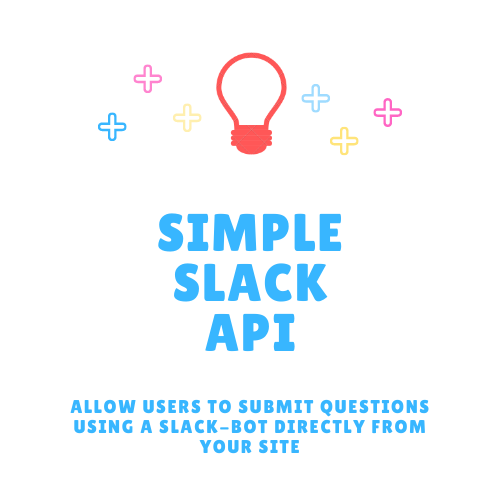

[![Contributors][contributors-shield]][contributors-url]
[![Forks][forks-shield]][forks-url]
[![Stargazers][stars-shield]][stars-url]
[![Issues][issues-shield]][issues-url]
[![LinkedIn][linkedin-shield]][linkedin-url]

  <h3 align="center">Simple Slack API</h3>

 

  

<!-- TABLE OF CONTENTS -->

  
<h2 style="display: inline-block">Table of Contents</h2>

  <ol>
    <li>
      <ul>
        <li><a href="#prerequisites">Prerequisites</a></li>
        <li><a href="#usage">Usage</a></li>
      </ul>
    </li>
    <li><a href="#contributing">Contributing</a></li>
    <li><a href="#ideas">Ideas</a></li>
  </ol>

## Prerequisites

1. A SlackBot with WebHook
2. Rails 6.0.3.4
3. Ruby 2.7.2

## Usage
1. Once the project is setup you must first create a user and the user must be logged in.
2. The users token is used to authenticate to send a message
3. The slack webook ENV variable must be named **SLACK_HOOK**
4. Example calls <a href="https://documenter.getpostman.com/view/6696508/TVsrEUJs">using Postman</a>
<ul>
  <li>Signup</li>
  <li>Login</li>
  <li>Logout</li>
  <li>Post to slack</li>
</ul>
   

## Contributing

Contributions are what make the open source community such an amazing place to be learn, inspire, and create. Any contributions you make are **greatly appreciated**.

1. Fork the Project
2. Create your Feature Branch (`git checkout -b feature/AmazingFeature`)
3. Commit your Changes (`git commit -m 'Add some AmazingFeature'`)
4. Push to the Branch (`git push origin feature/AmazingFeature`)
5. Open a Pull Request

## Ideas

Some simple ideas to add on:

1. Return list of messages sent by a user
2. User roles & the ability for admin to delete users
3. Two-factor authentication via Twilio or SendGrid (both already available for use but not configured)
4. Require user to verify their registration via SendGrid or Twilio

<!-- MARKDOWN LINKS & IMAGES -->
<!-- https://www.markdownguide.org/basic-syntax/#reference-style-links -->
[contributors-shield]: https://img.shields.io/github/contributors/leehodges/simple_slack_api.svg?style=for-the-badge
[contributors-url]: https://github.com/leehodges/simple_slack-api/graphs/contributors
[forks-shield]: https://img.shields.io/github/forks/leehodges/simple_slack_api.svg?style=for-the-badge
[forks-url]: https://github.com/leehodges/simple_slack_api/network/members
[stars-shield]: https://img.shields.io/github/stars/leehodges/simple_slack_api.svg?style=for-the-badge
[stars-url]: https://github.com/leehodges/simple_slack_api/stargazers
[issues-shield]: https://img.shields.io/github/issues/leehodges/simple_slack_api.svg?style=for-the-badge
[issues-url]: https://github.com/leehodges/simple_slack_api/issues
[linkedin-shield]: https://img.shields.io/badge/-LinkedIn-black.svg?style=for-the-badge&logo=linkedin&colorB=555
[linkedin-url]: https://linkedin.com/in/leehodges
[product-screenshot]: images/screenshot.png
